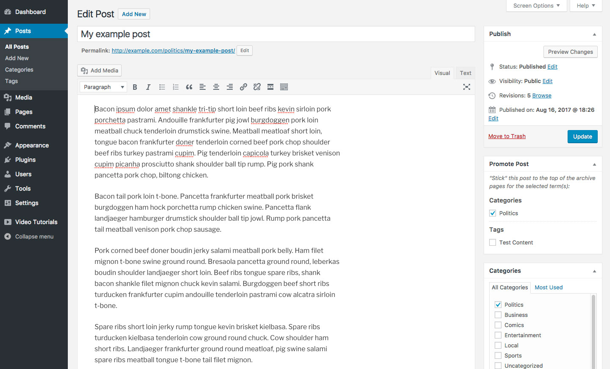
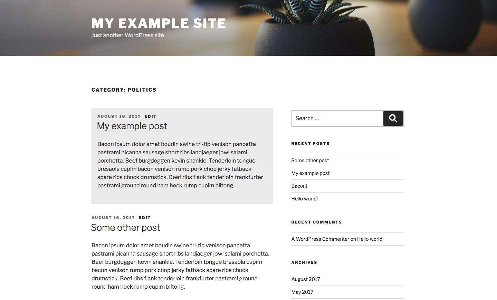

# Sticky Tax

[](https://travis-ci.org/liquidweb/sticky-tax)

A WordPress plugin that enables your content to be "sticky" within the context of one or more taxonomy terms!


## Why might I want this?

Let's imagine Chris, a long-time blogger with lots of traffic coming to his site. He's worked hard to categorize all of his content, but there are a few posts that he wants to make sure are the first thing people see when they hit a category landing page.

Using WordPress' default behavior, these important pieces of content will eventually get lost behind pagination, just because they're not the newest posts in the category.

With Sticky Tax, Chris can highlight the most important posts in a category, whether they were written last week or last year!


## Usage

After installing and activating Sticky Tax, a new "Sticky" meta box will appear on the post edit screen, with a list of terms for any public taxonomies registered on your site.




### On the front-end

Once a post has been made sticky for a category, it will be forced to the front of the list when users visit the category archive. Each sticky post even gets a `.sticky-tax` class added to it, enabling you to apply custom styling for your sticky content!




## Advanced usage

Sticky Tax is built with developer flexibility in mind, and includes a number of nice features for integrating with non-standard WordPress installation.


### Adding the Sticky meta box to additional post types

Out of the box, Sticky Tax only appears on the **post** edit screen. However, you're able to add it to any post type you'd like via the `stickytax_post_types` filter:

```php
/**
 * Add Sticky Tax support to the "my-cpt" post type.
 *
 * @param array $post_types Post types that should be able to use Sticky Tax.
 * @return array The filtered $post_types array.
 */
function add_sticky_tax_to_my_cpt( $post_types ) {
    $post_types[] = 'my-cpt';

    return $post_types;
}
add_filter( 'stickytax_post_types', 'add_sticky_tax_to_my_cpt' );
```

### Modifying the taxonomies included in Sticky Tax

Sticky Tax tries to be helpful, and will automatically include terms from any taxonomy [that has been registered as "public"](https://developer.wordpress.org/reference/functions/register_taxonomy/#parameters) for that post type. If you need to add or remove taxonomies from the list, you may do so via the `stickytax_taxonomies` filter:

```php
/**
 * Remove tags from the Sticky Tax meta box.
 *
 * @param array $taxonomies Taxonomies using Sticky Tax.
 * @return array The filtered $taxonomies array.
 */
function remove_tags_from_sticky_tax( $taxonomies ) {
  return array_diff( $taxonomies, array( 'post_tag' ) );
}
add_filter( 'stickytax_taxonomies', 'remove_tags_from_sticky_tax' );
```

### Working with custom taxonomy term meta boxes

If you've replaced the default category/tag meta boxes for either built-in or custom taxonomies, Sticky Tax may not be able to automatically mirror changes to the selected terms in the Sticky Tax meta box.

Fortunately, Sticky Tax exposes a simple API for adding or removing items from its list, via the `window.stickyTax.addItem()` and `window.stickyTax.removeItem()` methods.

#### Example

Let's say you have a list of pre-defined genres that posts can be assigned to, and the markup for the metabox looks something like this:

```html
<div id="my-custom-meta-box">
  <div class="inner">
    <ul>
      <li><label><input name="genre[]" type="checkbox" value="1"> Action</label></li>
      <li><label><input name="genre[]" type="checkbox" value="2"> Comedy</label></li>
      <li><label><input name="genre[]" type="checkbox" value="3"> Horror</label></li>
      <li><label><input name="genre[]" type="checkbox" value="4"> Romance</label></li>
    </ul>
  </div>
</div>
```

You could listen for terms to be selected or deselected using the following code snippet:

```js
document.getElementById('my-custom-meta-box').addEventListener('change', function (e) {
  var el = e.target;

  // Return early if the change event isn't on a checkbox.
  if ('INPUT' !== el.tagName) {
    return;
  }

  if (el.checked) {
    window.stickyTax.addItem(el.value, genre.parentElement.innerText, 'genre');
  } else {
    window.stickyTax.removeItem(el.value, 'genre');
  }
});
```
